# T3.chat Clone - Advanced AI Chat Application

<p align="center">
  
  
  
  
  
</p>

An intelligent, full-stack AI chat application inspired by [T3.chat](https://t3.chat). Built with **Next.js 16** and **FastAPI**, featuring a persistent memory system that learns about users over time, multi-model support via Groq's ultra-fast LPU inference, and a high-performance real-time streaming interface.

---

## 📑 Table of Contents

- [Key Features](#-key-features)
- [Architecture Overview](#-architecture-overview)
- [System Design Deep Dive](#-system-design-deep-dive)
- [Technology Stack](#-technology-stack)
- [Project Structure](#-project-structure)
- [Component Hierarchy](#-component-hierarchy)
- [Data Flow](#-data-flow)
- [API Reference](#-api-reference)
- [Memory System](#-memory-system)
- [Setup & Installation](#-setup--installation)
- [Environment Variables](#-environment-variables)
- [Development](#-development)

---

## 🚀 Key Features

### 🧠 Adaptive Memory System
Unlike standard chatbots that forget you after a session, this application maintains a **long-term memory** of your facts and preferences.

| Feature | Description |
|---------|-------------|
| **Extraction Engine** | A secondary lightweight LLM (Llama 8B Instant) analyzes every conversation in the background to extract personal facts |
| **Smart Deduplication** | Three-tier strategy: exact matching, substring containment, and token overlap analysis (>80% similarity) |
| **Context Injection** | Relevant memories are automatically injected into system prompts for personalized responses |
| **Manual Memory Management** | Users can view, add, and delete memories through a settings interface |

### ⚡ Real-Time Streaming (SSE)
| Feature | Description |
|---------|-------------|
| **Protocol** | Server-Sent Events (SSE) for unidirectional real-time communication |
| **Robust Parsing** | Custom implementation handles cross-platform stream artifacts (`\r` characters on Windows) |
| **Optimized Rendering** | Memoized markdown renderer handles high-frequency token updates without flashing |
| **Smart Auto-Scroll** | Intelligent scroll behavior that pauses when user scrolls up |

### 🤖 Multi-Model Intelligence
| Feature | Description |
|---------|-------------|
| **Groq LPU** | Leverages Groq's Language Processing Unit for near-instant responses |
| **Model Selection** | Dynamic switching between Llama 3 models (70B for reasoning, 8B for speed) |
| **5 Available Models** | Llama 3.3 70B, Llama 3.1 70B, Llama 3.1 8B, Llama 3 70B, Llama 3 8B |

### 🔐 Authentication & Personalization
| Feature | Description |
|---------|-------------|
| **Clerk Integration** | Full authentication with social login support |
| **User Profiles** | Personal settings including nickname, occupation, and custom about text |
| **Conversation History** | Persistent chat history with search and date grouping |

---

## 🏗️ Architecture Overview

The application follows a **decoupled client-server architecture** with clear separation of concerns.

```mermaid
graph TB
    subgraph Client["🖥️ Frontend (Next.js 16)"]
        direction TB
        UI["React UI Components"]
        Context["ChatContext Provider"]
        API_Client["API Client (Fetch + SSE)"]
        Auth["Clerk Authentication"]
    end

    subgraph Server["⚙️ Backend (FastAPI)"]
        direction TB
        Routes["API Routes"]
        
        subgraph Agent["🤖 LangGraph Agent"]
            LoadMem["Load Memory Node"]
            Generate["Generate Response Node"]
            Extract["Extract Facts Node"]
        end
        
        MemMgr["Memory Manager"]
        Checkpoint["Checkpointer"]
    end

    subgraph External["☁️ External Services"]
        MongoDB[("MongoDB Atlas")]
        Groq["Groq API"]
        ClerkAPI["Clerk API"]
    end

    UI --> Context
    Context --> API_Client
    Auth --> ClerkAPI
    API_Client -->|"REST/SSE"| Routes
    Routes --> Agent
    LoadMem --> MemMgr
    Generate -->|"Streaming"| Groq
    Extract --> MemMgr
    MemMgr --> MongoDB
    Checkpoint --> MongoDB
```



---

## 🔬 System Design Deep Dive

### Request-Response Lifecycle


### LangGraph State Machine


---

## 🛠️ Technology Stack

### Frontend Stack

| Technology | Version | Purpose |
|------------|---------|---------|
| **Next.js** | 16.1.1 | React framework with App Router |
| **React** | 19.2.3 | UI library |
| **TypeScript** | 5.x | Type safety |
| **Tailwind CSS** | 4.1.18 | Utility-first styling |
| **Radix UI** | Latest | Accessible UI primitives |
| **Clerk** | 6.36.7 | Authentication |
| **Lucide React** | 0.562.0 | Icons |
| **react-markdown** | 10.1.0 | Markdown rendering |
| **react-syntax-highlighter** | 16.1.0 | Code highlighting |

### Backend Stack

| Technology | Version | Purpose |
|------------|---------|---------|
| **FastAPI** | Latest | Async web framework |
| **Python** | 3.12+ | Runtime |
| **LangGraph** | Latest | Agent workflow orchestration |
| **LangChain** | Latest | LLM abstractions |
| **langchain-groq** | Latest | Groq LLM integration |
| **Motor** | Latest | Async MongoDB driver |
| **PyMongo** | Latest | Sync MongoDB driver |
| **Pydantic** | 2.x | Data validation |
| **SSE-Starlette** | Latest | Server-Sent Events |

### Infrastructure

| Service | Purpose |
|---------|---------|
| **MongoDB Atlas** | Primary database for conversations, memories, and user data |
| **Groq Cloud** | LLM inference with LPU acceleration |
| **Clerk** | User authentication and management |

---

## 📂 Project Structure

```
t3_chat/
├── 📄 README.md                    # This file
│
├── 📁 backend/                     # FastAPI Backend
│   ├── 📄 main.py                  # Application entry point
│   ├── 📄 config.py                # Settings & model configs
│   ├── 📄 database.py              # MongoDB connection management
│   ├── 📄 requirements.txt         # Python dependencies
│   │
│   ├── 📁 agent/                   # LangGraph AI Agent
│   │   ├── 📄 __init__.py          # Exports invoke_chat, stream_chat
│   │   ├── 📄 graph.py             # Graph nodes & workflow definition
│   │   ├── 📄 llm_provider.py      # Groq LLM factory
│   │   └── 📄 prompts.py           # System & extraction prompts
│   │
│   ├── 📁 memory/                  # Memory Subsystem
│   │   ├── 📄 __init__.py          # Module exports
│   │   ├── 📄 manager.py           # Memory CRUD & deduplication
│   │   ├── 📄 store.py             # MongoDB Store wrapper
│   │   ├── 📄 checkpointer.py      # LangGraph state persistence
│   │   └── 📄 cleanup.py           # Memory cleanup utilities
│   │
│   ├── 📁 models/                  # Pydantic Schemas
│   │   ├── 📄 __init__.py          # Schema exports
│   │   └── 📄 schemas.py           # Request/Response models
│   │
│   └── 📁 routes/                  # API Endpoints
│       ├── 📄 __init__.py          # Router exports
│       ├── 📄 chat.py              # Chat & streaming endpoints
│       ├── 📄 conversations.py     # Conversation management
│       ├── 📄 models.py            # Available models endpoint
│       └── 📄 users.py             # User profile & memories
│
└── 📁 frontend/                    # Next.js Frontend
    ├── 📄 package.json             # Node dependencies
    ├── 📄 next.config.ts           # Next.js configuration
    ├── 📄 tsconfig.json            # TypeScript config
    ├── 📄 tailwind.config.ts       # Tailwind configuration
    │
    ├── 📁 public/                  # Static assets
    │
    └── 📁 src/
        ├── 📄 middleware.ts        # Clerk auth middleware
        │
        ├── 📁 app/                 # Next.js App Router
        │   ├── 📄 layout.tsx       # Root layout with Clerk
        │   ├── 📄 page.tsx         # Home page
        │   └── 📄 globals.css      # Global styles
        │
        ├── 📁 components/          # React Components
        │   ├── 📄 MainLayout.tsx   # App shell with providers
        │   ├── 📄 ChatArea.tsx     # Chat interface
        │   ├── 📄 Sidebar.tsx      # Conversation list
        │   ├── 📄 MarkdownRenderer.tsx  # Streaming markdown
        │   ├── 📄 SettingsModal.tsx    # User settings
        │   ├── 📄 LoginPromptModal.tsx # Auth prompt
        │   ├── 📄 ThemeToggle.tsx  # Dark/light mode
        │   ├── 📄 theme-provider.tsx # Theme context
        │   └── 📁 ui/              # Shadcn UI components
        │
        └── 📁 lib/                 # Utilities & Context
            ├── 📄 api.ts           # API client & SSE parser
            ├── 📄 chat-context.tsx # Global chat state
            └── 📄 utils.ts         # Helper functions
```

---

## 🧩 Component Hierarchy


---

## 🔄 Data Flow

### Frontend State Management


### Backend Data Models


---

## 📡 API Reference

### Chat Endpoints

| Method | Endpoint | Description |
|--------|----------|-------------|
| `POST` | `/api/chat` | Send message, get response |
| `POST` | `/api/chat/stream` | Send message, stream response (SSE) |

### Conversation Endpoints

| Method | Endpoint | Description |
|--------|----------|-------------|
| `GET` | `/api/conversations` | List user conversations |
| `GET` | `/api/conversations/{id}` | Get conversation with messages |
| `PATCH` | `/api/conversations/{id}` | Update conversation title |
| `DELETE` | `/api/conversations/{id}` | Delete conversation |

### User Endpoints

| Method | Endpoint | Description |
|--------|----------|-------------|
| `GET` | `/api/users/{id}/profile` | Get user profile |
| `PUT` | `/api/users/{id}/profile` | Update user profile |
| `GET` | `/api/users/{id}/about` | Get "About You" settings |
| `PUT` | `/api/users/{id}/about` | Update "About You" settings |
| `GET` | `/api/users/{id}/memories` | List user memories |
| `POST` | `/api/users/{id}/memories` | Add manual memory |
| `DELETE` | `/api/users/{id}/memories/{key}` | Delete specific memory |
| `DELETE` | `/api/users/{id}/memories` | Clear all memories |

### Model Endpoints

| Method | Endpoint | Description |
|--------|----------|-------------|
| `GET` | `/api/models` | List available LLM models |

---

## 🧠 Memory System

### How Memory Works


### Memory Types

| Type | Source | Example |
|------|--------|---------|
| `fact` | Auto-extracted | "User is a Python developer" |
| `core_fact` | User settings | "User's name is John" |
| `preference` | Manual | "Prefers concise responses" |

### Deduplication Strategies

```python
# Strategy 1: Exact Match (case-insensitive)
"user is a developer" == "User is a Developer"  # True -> Skip

# Strategy 2: Substring Containment
"user works at Google" in "user works at Google as an engineer"  # True -> Skip

# Strategy 3: Token Overlap (>80%)
tokens1 = {"user", "is", "a", "software", "developer"}
tokens2 = {"user", "is", "a", "python", "developer"}
overlap = 4/5 = 80%  # True -> Skip
```

---

## 🚀 Setup & Installation

### Prerequisites

- **Node.js** 18+ 
- **Python** 3.11+
- **MongoDB** (Local or Atlas)
- **Groq API Key** ([Get one here](https://console.groq.com))
- **Clerk Account** ([Sign up here](https://clerk.com))

### 1. Clone the Repository

```bash
git clone https://github.com/yourusername/t3-chat-clone.git
cd t3-chat-clone
```

### 2. Backend Setup

```bash
cd backend

# Create virtual environment
python -m venv .venv

# Activate (Windows)
.venv\Scripts\activate

# Activate (Mac/Linux)
source .venv/bin/activate

# Install dependencies
pip install -r requirements.txt
```

### 3. Frontend Setup

```bash
cd frontend

# Install dependencies
npm install
```

---

## 🔐 Environment Variables

### Backend `.env`

```env
# Required
GROQ_API_KEY=gsk_your_api_key_here

# MongoDB
MONGODB_URL=mongodb://localhost:27017
DATABASE_NAME=t3_chat

# Optional: LangSmith Tracing
LANGSMITH_API_KEY=
LANGSMITH_PROJECT=t3-chat-clone
LANGSMITH_TRACING=false
```

### Frontend `.env.local`

```env
# API
NEXT_PUBLIC_API_URL=http://localhost:8000

# Clerk Authentication
NEXT_PUBLIC_CLERK_PUBLISHABLE_KEY=pk_test_...
CLERK_SECRET_KEY=sk_test_...
```

---

## 💻 Development

### Running the Backend

```bash
cd backend
uvicorn main:app --reload --port 8000
```

The API will be available at:
- **API**: http://localhost:8000
- **Docs**: http://localhost:8000/docs (Swagger UI)
- **Health**: http://localhost:8000/health

### Running the Frontend

```bash
cd frontend
npm run dev
```

The app will be available at:
- **App**: http://localhost:3000

### Available Scripts

**Frontend:**
```bash
npm run dev      # Start development server
npm run build    # Build for production
npm run start    # Start production server
npm run lint     # Run ESLint
```

**Backend:**
```bash
uvicorn main:app --reload    # Development with hot reload
uvicorn main:app             # Production mode
```

---

## 📊 Available Models

| Model | ID | Context | Best For |
|-------|-----|---------|----------|
| **Llama 3.3 70B Versatile** | `llama-3.3-70b-versatile` | 128K | Complex reasoning |
| **Llama 3.1 70B Versatile** | `llama-3.1-70b-versatile` | 128K | General tasks |
| **Llama 3.1 8B Instant** | `llama-3.1-8b-instant` | 128K | Fast responses |
| **Llama 3 70B** | `llama3-70b-8192` | 8K | High quality |
| **Llama 3 8B** | `llama3-8b-8192` | 8K | Quick tasks |

---

## 🎨 UI Features

- **Dark/Light Theme**: System-aware with manual toggle
- **Responsive Design**: Works on desktop and mobile
- **Conversation Grouping**: Today, Yesterday, Previous 7 Days, Older
- **Smart Auto-Scroll**: Pauses when user scrolls up, resumes on new message
- **Streaming Indicators**: Visual feedback during response generation
- **Code Syntax Highlighting**: Using Prism with One Dark theme
- **Markdown Support**: Full markdown rendering with custom styling

---

## 🔧 Technical Highlights

### SSE Stream Parsing

The frontend implements a robust SSE parser that handles:
- Windows line endings (`\r\n`)
- Multi-line data fields
- Event type switching
- Graceful error handling

```typescript
// Key implementation in api.ts
for (const rawLine of lines) {
    // Handle Windows line endings
    const line = rawLine.endsWith('\r') ? rawLine.slice(0, -1) : rawLine;
    // Process SSE events...
}
```

### LangGraph Workflow

The backend uses LangGraph's StateGraph for deterministic AI workflows:

```python
# Graph flow: START -> load_memory -> generate_response -> extract_memories -> END
builder = StateGraph(ChatState)
builder.add_node("load_memory", load_memory)
builder.add_node("generate_response", generate_response)
builder.add_node("extract_memories", extract_memories)
builder.add_edge(START, "load_memory")
builder.add_edge("load_memory", "generate_response")
builder.add_edge("generate_response", "extract_memories")
builder.add_edge("extract_memories", END)
```

---

## 📝 License

This project is for educational purposes.

---

<p align="center">
  Built with ❤️ using Next.js, FastAPI, and LangGraph
</p>
