# T3.chat Clone - Advanced AI Chat Application

<p align="center">
  
  
  
  
  
  
</p>

A full-stack AI chat application inspired by [T3.chat](https://t3.chat). Built with **Next.js 16** (App Router) and **FastAPI**, featuring a persistent memory system that learns about users over time, multi-model support via Groq's ultra-fast LPU inference, and real-time streaming responses.

---

## 📑 Table of Contents

- [Key Features](#-key-features)
- [Architecture Overview](#-architecture-overview)
- [System Design Deep Dive](#-system-design-deep-dive)
- [Technology Stack](#-technology-stack)
- [Project Structure](#-project-structure)
- [Component Hierarchy](#-component-hierarchy)
- [Data Flow](#-data-flow)
- [API Reference](#-api-reference)
- [Memory System](#-memory-system)
- [Setup & Installation](#-setup--installation)
- [Environment Variables](#-environment-variables)
- [Development](#-development)
- [Available Models](#-available-models)
- [UI Features](#-ui-features)

---

## 🚀 Key Features

### 🧠 Adaptive Memory System
Unlike standard chatbots that forget you after a session, this application maintains a **long-term memory** of user facts and preferences.

| Feature | Description |
|---------|-------------|
| **Automatic Fact Extraction** | A lightweight LLM (`llama-3.1-8b-instant`) runs in the background after each conversation to extract personal facts the user shares |
| **Smart Deduplication** | Three-tier strategy prevents duplicate memories: exact matching (case-insensitive), substring containment, and token overlap analysis (≥80% similarity) |
| **Context Injection** | Relevant memories are automatically injected into the system prompt with "Things I remember about you:" prefix |
| **Manual Memory Management** | Users can view, add, and delete memories through a Settings modal interface |
| **Core Facts from Settings** | User profile info (nickname, occupation, about) is stored as `core_fact` type memories |

### ⚡ Real-Time Streaming (SSE)
| Feature | Description |
|---------|-------------|
| **Protocol** | Server-Sent Events (SSE) via `sse-starlette` for unidirectional real-time communication |
| **Robust Parsing** | Custom SSE parser in `api.ts` handles Windows line endings (`\r\n`), multi-line data fields, and event type switching |
| **Optimized Rendering** | `React.memo()` on `MarkdownRenderer` prevents re-renders during high-frequency token updates |
| **Smart Auto-Scroll** | Scroll behavior pauses when user scrolls up (>100px from bottom), resumes when near bottom or on new message |

### 🤖 Multi-Model Intelligence
| Feature | Description |
|---------|-------------|
| **Groq LPU** | Leverages Groq's Language Processing Unit for near-instant inference |
| **Dynamic Model Selection** | Users can switch models mid-session via dropdown in the chat input area |
| **Default Model** | `meta-llama/llama-4-maverick-17b-128e-instruct` (Llama 4 Maverick) |
| **8 Available Models** | See [Available Models](#-available-models) section for full list |

### 🔐 Authentication & Personalization
| Feature | Description |
|---------|-------------|
| **Clerk Integration** | Full authentication via `@clerk/nextjs` with modal sign-in/sign-out |
| **Protected Actions** | Chat sending requires authentication (shows `LoginPromptModal` for unauthenticated users) |
| **User Settings** | "About You" panel for nickname, occupation, and custom about text |
| **Conversation History** | Persistent conversations grouped by date (Today, Yesterday, Previous 7 Days, Older) |

### 🎨 Theme Support
| Feature | Description |
|---------|-------------|
| **Dark/Light Mode** | System-aware theming with manual toggle via `next-themes` |
| **Smooth Transitions** | CSS transitions on theme change |

---

## 🏗️ Architecture Overview

The application follows a **decoupled client-server architecture** with clear separation of concerns.

```mermaid
graph TB
    subgraph Client["🖥️ Frontend (Next.js 16)"]
        direction TB
        UI["React UI Components"]
        Context["ChatContext Provider"]
        API_Client["API Client (Fetch + SSE)"]
        Auth["Clerk Authentication"]
    end

    subgraph Server["⚙️ Backend (FastAPI)"]
        direction TB
        Routes["API Routes"]
        
        subgraph Agent["🤖 LangGraph Agent"]
            LoadMem["load_memory Node"]
            Generate["generate_response Node"]
            Extract["extract_memories Node"]
        end
        
        MemMgr["MemoryManager"]
        Checkpoint["MongoDBSaver Checkpointer"]
        Store["MongoDBStore"]
    end

    subgraph External["☁️ External Services"]
        MongoDB[("MongoDB Local")]
        Groq["Groq Cloud API"]
        ClerkAPI["Clerk API"]
    end

    UI --> Context
    Context --> API_Client
    Auth --> ClerkAPI
    API_Client -->|"REST/SSE"| Routes
    Routes --> Agent
    LoadMem --> MemMgr
    Generate -->|"Streaming"| Groq
    Extract --> MemMgr
    MemMgr --> Store
    Store --> MongoDB
    Checkpoint --> MongoDB
```



---

## 🔬 System Design Deep Dive

### Request-Response Lifecycle


### LangGraph State Machine

The backend uses LangGraph's `StateGraph` with a `ChatState` TypedDict:

```python
class ChatState(TypedDict):
    messages: Annotated[list, add_messages]  # Conversation messages
    user_id: str                             # User identifier
    model_name: str                          # Selected LLM model
    memory_context: str                      # Formatted memories string
    last_user_message: str                   # For extraction
    last_assistant_response: str             # For extraction
```


---

## 🛠️ Technology Stack

### Frontend Stack

| Technology | Version | Purpose |
|------------|---------|---------|
| **Next.js** | 16.1.1 | React framework with App Router |
| **React** | 19.2.3 | UI library |
| **TypeScript** | 5.x | Type safety |
| **Tailwind CSS** | 4.1.18 | Utility-first styling |
| **Radix UI** | Latest | Accessible UI primitives (avatar, dialog, dropdown-menu, scroll-area, separator, tooltip) |
| **Clerk** | 6.36.7 | Authentication (`@clerk/nextjs`) |
| **next-themes** | 0.4.6 | Dark/Light mode theming |
| **Lucide React** | 0.562.0 | Icon library |
| **react-markdown** | 10.1.0 | Markdown rendering |
| **react-syntax-highlighter** | 16.1.0 | Code block syntax highlighting (Prism + One Dark theme) |
| **tailwind-merge** | 3.4.0 | Merge Tailwind classes |
| **clsx** | 2.1.1 | Conditional class names |
| **class-variance-authority** | 0.7.1 | Component variants |

### Backend Stack

| Technology | Version | Purpose |
|------------|---------|---------|
| **FastAPI** | Latest | Async web framework |
| **Python** | 3.11+ | Runtime |
| **LangGraph** | Latest | Agent workflow orchestration (StateGraph) |
| **LangChain Core** | Latest | LLM abstractions |
| **langchain-groq** | Latest | Groq LLM integration (`ChatGroq`) |
| **Motor** | Latest | Async MongoDB driver |
| **PyMongo** | Latest | Sync MongoDB driver (for LangGraph checkpointer) |
| **langgraph-checkpoint-mongodb** | Latest | `MongoDBSaver` for conversation state persistence |
| **langgraph-store-mongodb** | Latest | `MongoDBStore` for long-term memory |
| **Pydantic** | 2.x | Data validation |
| **pydantic-settings** | Latest | Environment variable management |
| **SSE-Starlette** | Latest | Server-Sent Events (`EventSourceResponse`) |
| **uvicorn** | Latest | ASGI server |

### Infrastructure

| Service | Purpose |
|---------|---------|
| **MongoDB (Local)** | Primary database - stores conversations, memories, user settings, checkpoints |
| **Groq Cloud** | LLM inference with LPU acceleration |
| **Clerk** | User authentication and session management |

---

## 📂 Project Structure

```
t3_chat/
├── 📄 README.md                    # This documentation file
│
├── 📁 backend/                     # FastAPI Backend (Python)
│   ├── 📄 main.py                  # FastAPI app entry point, CORS, routers
│   ├── 📄 config.py                # Settings class, AVAILABLE_MODELS list, DEFAULT_MODEL
│   ├── 📄 database.py              # MongoDB connection management (async + sync clients)
│   ├── 📄 requirements.txt         # Python dependencies
│   ├── 📄 pyproject.toml           # Python project config
│   │
│   ├── 📁 agent/                   # LangGraph AI Agent
│   │   ├── 📄 __init__.py          # Exports invoke_chat(), stream_chat()
│   │   ├── 📄 graph.py             # ChatState, graph nodes, create_chat_graph()
│   │   ├── 📄 llm_provider.py      # get_llm() factory for ChatGroq
│   │   └── 📄 prompts.py           # SYSTEM_PROMPT, MEMORY_EXTRACTION_PROMPT
│   │
│   ├── 📁 memory/                  # Memory Subsystem
│   │   ├── 📄 __init__.py          # Module exports
│   │   ├── 📄 manager.py           # MemoryManager class with CRUD + deduplication
│   │   ├── 📄 store.py             # get_memory_store() -> MongoDBStore
│   │   ├── 📄 checkpointer.py      # get_checkpointer() -> MongoDBSaver
│   │   └── 📄 cleanup.py           # cleanup_conversation_memory() for deletions
│   │
│   ├── 📁 models/                  # Pydantic Schemas
│   │   ├── 📄 __init__.py          # Schema exports
│   │   └── 📄 schemas.py           # Message, ChatRequest, ChatResponse, Conversation, etc.
│   │
│   └── 📁 routes/                  # API Endpoints
│       ├── 📄 __init__.py          # Router exports
│       ├── 📄 chat.py              # POST /api/chat, POST /api/chat/stream
│       ├── 📄 conversations.py     # GET/PATCH/DELETE /api/conversations
│       ├── 📄 models.py            # GET /api/models
│       └── 📄 users.py             # User profile, About You, memories endpoints
│
└── 📁 frontend/                    # Next.js Frontend (TypeScript)
    ├── 📄 package.json             # Node dependencies
    ├── 📄 next.config.ts           # Next.js configuration
    ├── 📄 tsconfig.json            # TypeScript config
    ├── 📄 postcss.config.mjs       # PostCSS for Tailwind
    ├── 📄 components.json          # shadcn/ui config
    │
    ├── 📁 public/                  # Static assets
    │
    └── 📁 src/
        ├── 📄 middleware.ts        # Clerk middleware (clerkMiddleware)
        │
        ├── 📁 app/                 # Next.js App Router
        │   ├── 📄 layout.tsx       # Root layout with ClerkProvider
        │   ├── 📄 page.tsx         # Home page -> MainLayout
        │   └── 📄 globals.css      # Global Tailwind styles
        │
        ├── 📁 components/          # React Components
        │   ├── 📄 MainLayout.tsx   # App shell (ThemeProvider + ChatProvider)
        │   ├── 📄 ChatArea.tsx     # Chat interface, message list, input area
        │   ├── 📄 Sidebar.tsx      # Conversation list, user profile, settings button
        │   ├── 📄 MarkdownRenderer.tsx  # Memoized markdown with syntax highlighting
        │   ├── 📄 SettingsModal.tsx    # About You + Memory management tabs
        │   ├── 📄 LoginPromptModal.tsx # Auth prompt for unauthenticated users
        │   ├── 📄 ThemeToggle.tsx  # Dark/light mode toggle button
        │   ├── 📄 theme-provider.tsx   # next-themes ThemeProvider wrapper
        │   └── 📁 ui/              # shadcn/ui components
        │       ├── avatar.tsx, button.tsx, dropdown-menu.tsx, input.tsx
        │       ├── scroll-area.tsx, separator.tsx, sheet.tsx
        │       ├── textarea.tsx, tooltip.tsx
        │
        └── 📁 lib/                 # Utilities & Context
            ├── 📄 api.ts           # API client, streamMessage() SSE parser
            ├── 📄 chat-context.tsx # ChatProvider with global state
            └── 📄 utils.ts         # cn() helper (clsx + tailwind-merge)
```

---

## 🧩 Component Hierarchy


---

## 🔄 Data Flow

### Frontend State Management

The `ChatContext` in [chat-context.tsx](frontend/src/lib/chat-context.tsx) provides global state:

```typescript
interface ChatContextType {
    // State
    messages: Message[];           // Current conversation messages
    isLoading: boolean;            // Loading state during API calls
    error: string | null;          // Error message if any
    conversationId: string | null; // Current conversation ID
    conversations: ConversationSummary[]; // All user conversations
    selectedModel: string;         // Currently selected LLM model
    models: ModelInfo[];           // Available models from API
    userId: string;                // Clerk user ID or 'anonymous-user'
    isAuthenticated: boolean;      // Whether user is signed in

    // Actions
    sendChatMessage: (content: string) => Promise<void>;
    startNewChat: () => void;
    selectConversation: (id: string) => Promise<void>;
    deleteConversation: (id: string) => Promise<void>;
    setSelectedModel: (modelId: string) => void;
    refreshConversations: () => Promise<void>;
}
```


### Backend Data Models (MongoDB Collections)


---

## 📡 API Reference

### Chat Endpoints

| Method | Endpoint | Description | Request Body |
|--------|----------|-------------|--------------|
| `POST` | `/api/chat` | Send message, get full response | `ChatRequest` |
| `POST` | `/api/chat/stream` | Send message, stream response (SSE) | `ChatRequest` |

**ChatRequest Schema:**
```json
{
    "message": "string",
    "user_id": "string",
    "conversation_id": "string | null",
    "model_name": "string | null"
}
```

**SSE Events from `/api/chat/stream`:**
- `event: message` → `data: <token chunk>`
- `event: done` → `data: {"conversation_id": "...", "model_used": "..."}`
- `event: error` → `data: <error message>`

### Conversation Endpoints

| Method | Endpoint | Description | Query Params |
|--------|----------|-------------|--------------|
| `GET` | `/api/conversations` | List user conversations | `user_id`, `limit`, `offset` |
| `GET` | `/api/conversations/{id}` | Get conversation with messages | `user_id` |
| `PATCH` | `/api/conversations/{id}` | Update conversation title | `user_id` |
| `DELETE` | `/api/conversations/{id}` | Delete conversation + cleanup checkpoints | `user_id` |

### User Endpoints

| Method | Endpoint | Description |
|--------|----------|-------------|
| `GET` | `/api/users/{id}/profile` | Get user profile (creates if not exists) |
| `PUT` | `/api/users/{id}/profile` | Update user profile |
| `GET` | `/api/users/{id}/about` | Get "About You" settings |
| `PUT` | `/api/users/{id}/about` | Update "About You" + sync to memories |
| `GET` | `/api/users/{id}/memories` | List user memories |
| `POST` | `/api/users/{id}/memories` | Add manual memory (fact) |
| `DELETE` | `/api/users/{id}/memories/{key}` | Delete specific memory |
| `DELETE` | `/api/users/{id}/memories` | Clear all memories |

### Model Endpoints

| Method | Endpoint | Description |
|--------|----------|-------------|
| `GET` | `/api/models` | List available LLM models |
| `GET` | `/api/models/default` | Get default model info |

### Health Endpoints

| Method | Endpoint | Description |
|--------|----------|-------------|
| `GET` | `/health` | Health check |
| `GET` | `/` | API info with docs link |

---

## 🧠 Memory System

### How Memory Works

The memory system has two layers:
1. **Short-term Memory** (Checkpoints) - LangGraph state for conversation continuity
2. **Long-term Memory** (Memory Store) - Persistent facts about the user


### Memory Types

| Type | Key Pattern | Source | Example Content |
|------|-------------|--------|-----------------|
| `fact` | `fact_{md5hash[:12]}` | Auto-extracted | "User is a Python developer" |
| `core_fact` | `core_nickname`, `core_occupation`, `core_about` | User settings | "User's name/nickname is John" |
| `preference` | `pref_{category}` | Manual | Category-based preference |

### Deduplication Strategies (in order)

```python
# Strategy 1: Exact Match (case-insensitive)
fact_lower = "user is a developer"
existing_lower = "User is a Developer"
fact_lower == existing_lower  # True -> Skip

# Strategy 2: Substring Containment
"user works at google" in "user works at google as an engineer"  # True -> Skip
"user works at google as an engineer" in "user works at google"  # Also True -> Skip

# Strategy 3: Token Overlap (≥ 80%)
fact_tokens = {"user", "is", "a", "software", "developer"}
existing_tokens = {"user", "is", "a", "python", "developer"}
overlap = len(fact_tokens & existing_tokens) / min(len(fact_tokens), len(existing_tokens))
# overlap = 4/5 = 0.8 = 80% -> Skip
```

### Extraction Prompt

The extraction uses `MEMORY_EXTRACTION_PROMPT` in [prompts.py](backend/agent/prompts.py):

```
Extract important personal facts about the user from this message exchange.
Focus on information they share ABOUT THEMSELVES.

CRITICAL - Extract these if mentioned:
- Their name (e.g., "User's name is John")
- Their location/city
- Their job/profession/occupation
- Their interests and hobbies
- Their goals or what they're working on
- Their preferences

Rules:
- ONLY extract facts the USER explicitly stated about themselves
- Start each fact with "User's..." or "User is..." or "User works as..."
- Be specific and concise
- Do NOT extract facts about topics they asked about

Respond with ONLY a valid JSON array. If no personal facts, respond with [].
```

---

## 🚀 Setup & Installation

### Prerequisites

- **Node.js** 18+ (for Next.js 16)
- **Python** 3.11+
- **MongoDB** (Local installation recommended - use MongoDB Compass for GUI)
- **Groq API Key** ([Get one here](https://console.groq.com))
- **Clerk Account** ([Sign up here](https://clerk.com))

### 1. Clone the Repository

```bash
git clone <repository-url>
cd t3_chat
```

### 2. Backend Setup

```bash
cd backend

# Create virtual environment
python -m venv .venv

# Activate (Windows PowerShell)
.venv\Scripts\Activate.ps1

# Activate (Windows CMD)
.venv\Scripts\activate.bat

# Activate (Mac/Linux)
source .venv/bin/activate

# Install dependencies
pip install -r requirements.txt

# Create .env file (see Environment Variables section)
```

### 3. Frontend Setup

```bash
cd frontend

# Install dependencies
npm install

# Create .env.local file (see Environment Variables section)
```

### 4. MongoDB Setup

1. Install MongoDB locally or use MongoDB Atlas
2. Start MongoDB service (default: `mongodb://localhost:27017`)
3. The application will automatically create:
   - Database: `t3_chat`
   - Collections: `users`, `conversations`, `user_settings`, `memory_store`, `checkpoints`, `checkpoint_writes`

---

## 🔐 Environment Variables

### Backend `.env`

Create `backend/.env`:

```env
# Required - Groq API
GROQ_API_KEY=gsk_your_groq_api_key_here

# MongoDB (defaults shown)
MONGODB_URL=mongodb://localhost:27017
DATABASE_NAME=t3_chat

# Optional - LangSmith Tracing for debugging
LANGSMITH_API_KEY=
LANGSMITH_PROJECT=t3-chat-clone
LANGSMITH_TRACING=false
LANGSMITH_ENDPOINT=https://api.smith.langchain.com
```

### Frontend `.env.local`

Create `frontend/.env.local`:

```env
# Backend API URL
NEXT_PUBLIC_API_URL=http://localhost:8000

# Clerk Authentication (from Clerk Dashboard)
NEXT_PUBLIC_CLERK_PUBLISHABLE_KEY=pk_test_...
CLERK_SECRET_KEY=sk_test_...
```

---

## 💻 Development

### Running the Backend

```bash
cd backend

# Activate virtual environment first, then:
uvicorn main:app --reload --port 8000
```

The API will be available at:
- **API Root**: http://localhost:8000
- **Swagger Docs**: http://localhost:8000/docs
- **Health Check**: http://localhost:8000/health

### Running the Frontend

```bash
cd frontend
npm run dev
```

The app will be available at:
- **App**: http://localhost:3000

### Available Scripts

**Frontend (npm):**
```bash
npm run dev      # Start development server (Turbopack)
npm run build    # Build for production
npm run start    # Start production server
npm run lint     # Run ESLint
```

**Backend (Python):**
```bash
uvicorn main:app --reload    # Development with hot reload
uvicorn main:app             # Production mode
```

---

## 📊 Available Models

All models are served via Groq's LPU infrastructure:

| Model | ID | Context Window | Best For |
|-------|-----|----------------|----------|
| **Qwen 3 32B** | `qwen/qwen3-32b` | 32K | General tasks |
| **Groq Compound** | `groq/compound` | 8K | Compound AI tasks |
| **Llama 4 Maverick** ⭐ | `meta-llama/llama-4-maverick-17b-128e-instruct` | 128K | Complex reasoning (Default) |
| **Llama 4 Scout** | `meta-llama/llama-4-scout-17b-16e-instruct` | 128K | Fast exploration |
| **Kimi K2** | `moonshotai/kimi-k2-instruct-0905` | 128K | Moonshot AI model |
| **GPT OSS 120B** | `openai/gpt-oss-120b` | 128K | Large-scale tasks |
| **Llama 3.1 8B Instant** | `llama-3.1-8b-instant` | 128K | Fast responses, fact extraction |
| **Llama 3.3 70B Versatile** | `llama-3.3-70b-versatile` | 128K | Versatile tasks |

⭐ = Default model

---

## 🎨 UI Features

### Visual Design
- **Dark/Light Theme**: System-aware with manual toggle in header
- **Responsive Layout**: Collapsible sidebar for mobile
- **Glassmorphism**: Backdrop blur effects on input area and buttons
- **Pink Accent Color**: User messages, buttons, and highlights use `bg-pink-600`

### Chat Interface
- **Empty State**: "How can I help you?" with quick action buttons (Create, Explore, Code, Learn)
- **Message Bubbles**: User messages right-aligned (pink), assistant left-aligned (muted)
- **Smart Auto-Scroll**: Pauses when user scrolls up >100px, shows "scroll to bottom" button
- **Loading Indicator**: Spinner during response generation

### Sidebar
- **New Chat Button**: Prominent pink button at top
- **Search Input**: Search field for conversations (UI only)
- **Conversation Grouping**: Today, Yesterday, Previous 7 Days, Older
- **Delete Button**: Per-conversation trash icon with confirmation
- **User Profile**: Avatar, name, email, sign-out button
- **Settings Button**: Opens Settings modal

### Markdown Rendering
- **Code Blocks**: Syntax highlighting with Prism (One Dark theme)
- **Inline Code**: Pink text on muted background
- **Lists**: Proper bullet/numbered lists with spacing
- **Blockquotes**: Pink left border with italic text
- **Links**: Pink underlined links opening in new tab
- **Bold/Italic**: LLM streaming artifact normalization (fixes `** text **`)

### Settings Modal
- **About You Tab**: Nickname, occupation, about text inputs
- **Memory Tab**: List of all memories with delete buttons, clear all option

---

## 🔧 Technical Implementation Details

### SSE Stream Parsing (Frontend)

The `streamMessage()` generator in [api.ts](frontend/src/lib/api.ts) implements robust SSE parsing:

```typescript
// Handle Windows line endings
const line = rawLine.endsWith('\r') ? rawLine.slice(0, -1) : rawLine;

// Parse event types
if (line.startsWith('event: ')) {
    currentEvent = line.slice(7).trim();
} else if (line.startsWith('data:')) {
    // Strict SSE spec: remove "data:" prefix, then one optional space
    let data = line.slice(5);
    if (data.startsWith(' ')) data = data.slice(1);
    dataBuffer.push(data);
}
```

### LangGraph Workflow (Backend)

The graph in [graph.py](backend/agent/graph.py) uses LangGraph's StateGraph:

```python
def create_chat_graph() -> StateGraph:
    builder = StateGraph(ChatState)
    
    # Add nodes
    builder.add_node("load_memory", load_memory)
    builder.add_node("generate_response", generate_response)
    builder.add_node("extract_memories", extract_memories)
    
    # Linear flow: START -> load -> generate -> extract -> END
    builder.add_edge(START, "load_memory")
    builder.add_edge("load_memory", "generate_response")
    builder.add_edge("generate_response", "extract_memories")
    builder.add_edge("extract_memories", END)
    
    # Compile with MongoDB checkpointer
    checkpointer = get_checkpointer()
    return builder.compile(checkpointer=checkpointer)
```

### Memory Manager Deduplication

The `MemoryManager` class in [manager.py](backend/memory/manager.py) implements three-tier deduplication:

```python
def _is_duplicate_fact(self, fact: str, existing_memories: list) -> bool:
    fact_lower = fact.lower().strip()
    fact_tokens = set(fact_lower.split())
    
    for item in existing_memories:
        existing_content = value.get("content", "").lower().strip()
        existing_tokens = set(existing_content.split())
        
        # Strategy 1: Exact match
        if existing_content == fact_lower:
            return True
        
        # Strategy 2: Substring containment
        if fact_lower in existing_content or existing_content in fact_lower:
            return True
        
        # Strategy 3: Token overlap ≥ 80%
        if len(fact_tokens) > 2 and len(existing_tokens) > 2:
            overlap = len(fact_tokens & existing_tokens)
            similarity = overlap / min(len(fact_tokens), len(existing_tokens))
            if similarity >= 0.8:
                return True
    
    return False
```

### Conversation Cleanup

When a conversation is deleted via [cleanup.py](backend/memory/cleanup.py):

1. Delete all `checkpoints` for the thread_id
2. Delete all `checkpoint_writes` for the thread_id
3. Delete the conversation document
4. **Long-term memories are preserved** for future conversations

---

---

## ☁️ Deployment Guide

### Vercel + AWS EC2 Hybrid Architecture

This project uses a hybrid deployment strategy to get the best of both worlds:
- **Frontend**: Vercel (Edge Network, Fast CDN, Easy CI/CD)
- **Backend**: AWS EC2 (Full control, Persistent WebSocket/SSE connections, Dockerized DB)


### 1. AWS EC2 Setup (Backend)

We deployed the backend to a **t3.small** Ubuntu 24.04 instance.

**Key Steps:**
1.  **IAM User**: Created a dedicated `AdminUser` instead of using Root (Best Practice).
2.  **Security Groups**:
    -   Opened Port `22` (SSH) for admin access.
    -   Opened Port `80` (HTTP) and `443` (HTTPS) for public access.
3.  **Dependencies**:
    -   Installed `nginx`, `git`, `docker.io`, and `uv` (Astral's fast Python package manager).
    -   Python 3.13 installed via `uv python install 3.13`.

### 2. HTTPS & SSL (Certbot)

Since Vercel requires a secure backend (`https://`), we configured a custom subdomain.

-   **Domain**: `api.manimancer.fun`
-   **Method**: Nginx + Certbot (Let's Encrypt)
-   **Installation**: Used `snap` for Certbot (more reliable than apt on Ubuntu 24.04).

### 3. Frontend Deployment (Vercel)

-   **Root Directory**: Set to `frontend/` (Monorepo setup).
-   **Environment Variable**: `NEXT_PUBLIC_API_URL=https://api.manimancer.fun`.

---

## 🐛 Troubleshooting & Lessons Learned

During the initial deployment (Jan 2026), we encountered and solved several critical issues. This log serves as a reference for future deployments.

### 🔴 Issue 1: 502 Bad Gateway / Service Exit Code
**Symptoms**: Nginx was running, but `https://api.manimancer.fun/health` returned 502.
**Logs**: `sudo journalctl -u t3-backend` showed `ModuleNotFoundError: No module named 'motor'`.
**Cause**: The `pyproject.toml` file was missing several dependencies (`motor`, `pydantic-settings`, etc.) that were present in `requirements.txt` but not the `uv` lockfile.
**Fix**:
1.  Updated `pyproject.toml` to include all missing packages.
2.  Ran `uv sync` to regenerate the environment.
3.  Restarted service: `sudo systemctl restart t3-backend`.

### 🔴 Issue 2: Dependency Version Conflict
**Symptoms**: `uv sync` failed with a conflict error.
**Cause**: `langgraph-checkpoint-mongodb` required `pymongo<4.16`, but `pyproject.toml` pinned `pymongo>=4.16.0`.
**Fix**: Downgraded requirement to `pymongo>=4.12.0`.

### 🔴 Issue 3: SSH Lockout (Connection Timed Out)
**Symptoms**: Suddenly unable to SSH into the server (`ssh: connect to host ... port 22: Connection timed out`).
**Cause**: The admin's home IP address changed (dynamic ISP IP), causing the AWS Security Group rule "My IP" to block the new IP.
**Fix**:
1.  Temporarily allowed `0.0.0.0/0` (Anywhere) for Port 22 in AWS Console.
2.  Used **EC2 Instance Connect** (Browser-based SSH) as a backup.

### 🔴 Issue 4: Certbot Installation Failure
**Symptoms**: `sudo apt install python3-certbot-nginx` failed with "Unable to locate package".
**Cause**: Ubuntu 24.04 repositories occasionally miss the Certbot package or require `universe` enabled.
**Fix**: Switched to the official `snap` installation method:
```bash
sudo snap install --classic certbot
sudo ln -s /snap/bin/certbot /usr/bin/certbot
```

---

## 📝 License

This project is for educational purposes.

---

<p align="center">
  Built with ❤️ using Next.js 16, FastAPI, LangGraph, and Groq
</p>
